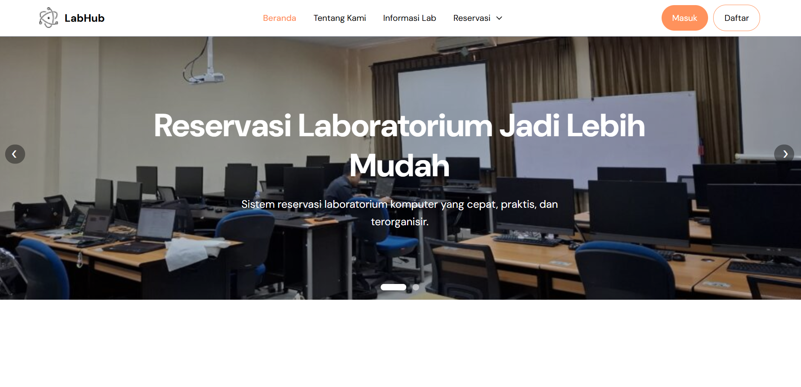
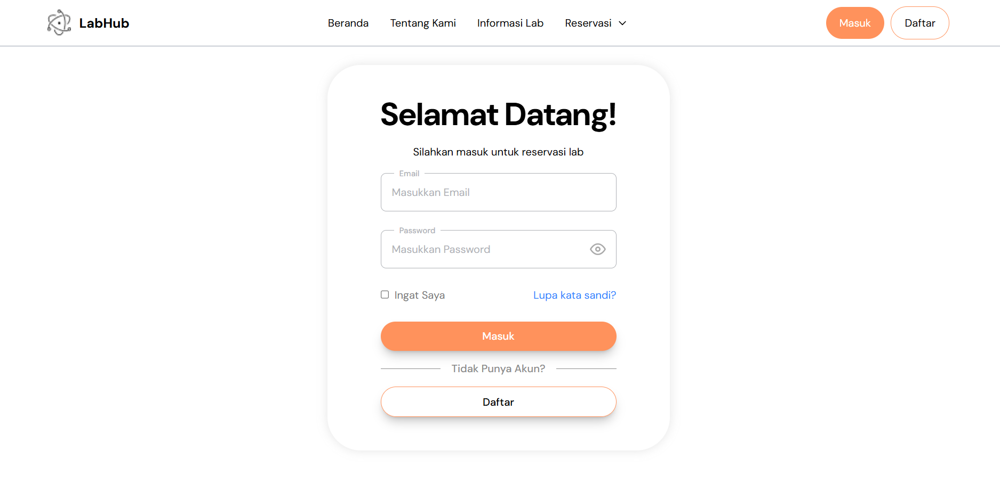

# Lab Reservation System

Website reservasi Lab Komputer berbasis PHP Native dengan fitur autentikasi, OTP email, reservasi jadwal, cek jadwal, dan dashboard admin.

---

# Features

- Login & Register
- OTP Email Verification
- Forgot Password
- Reset Password
- Reservasi Lab Komputer
- Riwayat Reservasi
- Cek Jadwal
- Dashboard Admin
- Responsive Design
- Role User & Admin

---

# Tech Stack

- PHP Native
- MySQL
- Composer
- Tailwind CSS
- JavaScript
- PHPMailer

---

# Installation

## 1. Clone Repository

```bash
git clone https://github.com/Lodi7/Sistem-Reservasi-Ruangan.git
```

---

## 2. Masuk Folder Project

```bash
cd name-project
```

---

## 3. Install Dependency Composer

```bash
composer install
```

---

## 4. Install Dependency Node.js

```bash
npm install
```

---

## 5. Buat File .env

Copy file `.env.examples` menjadi `.env`

### Windows CMD

```bash
copy .env.examples .env
```

### Git Bash / Linux

```bash
cp .env.examples .env
```

---

## 6. Isi Konfigurasi `.env`

Contoh:

```env
DB_HOST=localhost
DB_PORT=
DB_NAME=db_ruangan
DB_USER=
DB_PASS=

MAIL_USERNAME=example@gmail.com
MAIL_PASSWORD=yourpassword
```

---

## 7. Import Database

Import file SQL ke phpMyAdmin.

Contoh:
- buka phpMyAdmin
- buat database `db_ruangan`
- import file `.sql`

---

# Running Project

## Jalankan PHP

Jika menggunakan XAMPP:
- pindahkan project ke folder `htdocs`
- jalankan Apache & MySQL

Akses:

```txt
http://localhost/name-project
```

Jika menggunakan Laragon:
- pindahkan project ke folder `laragon/www`
- jalankan Apache & MySQL

Akses:

```txt
http://name-project.test
```


---

## Jalankan Tailwind CSS

```bash
npm run dev
```

Atau manual:

```bash
npx tailwindcss -i ./assets/css/input.css -o ./assets/css/output.css --watch
```

---

# Default Roles

## Mahasiswa & Dosen
- Login menggunakan email mahasiswa/dosen milik UPN
- Melakukan reservasi lab komputer
- Melihat riwayat reservasi
- Melihat Jadwal yang tersedia

## Admin
- Mengelola lab komputer
- Mengelola reservasi
- Validasi jadwal

---

# .gitignore

```gitignore
.env
/vendor/
/node_modules/
```

---

# Preview

| Home | Login |
|---|---|
|  |  |

# License

This project is for educational purposes.
